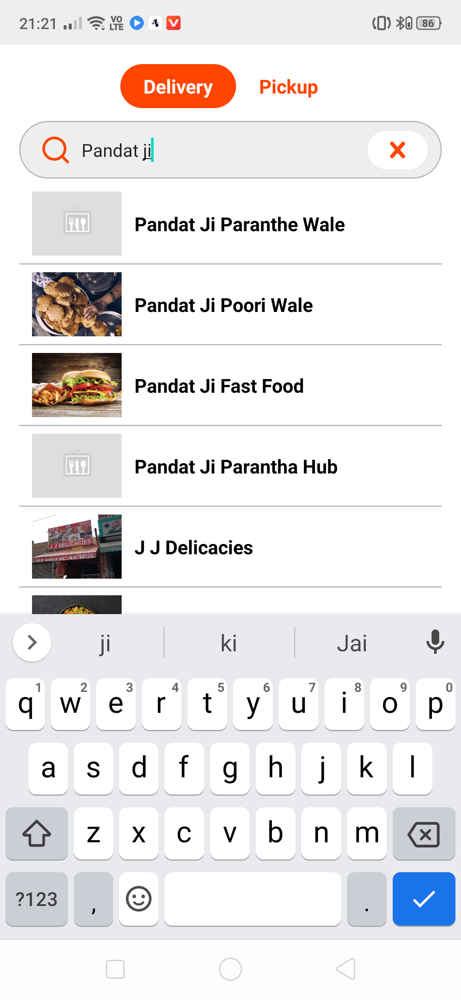
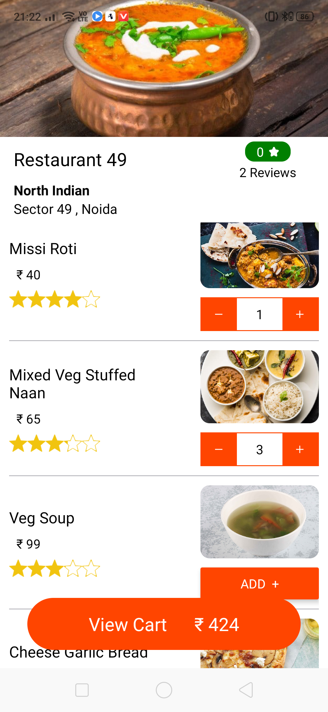
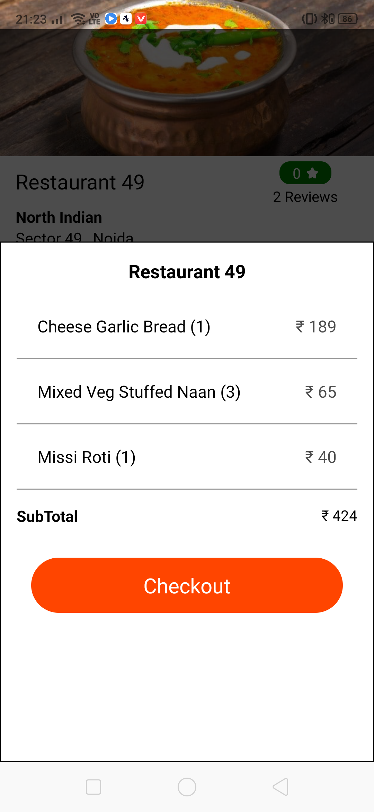
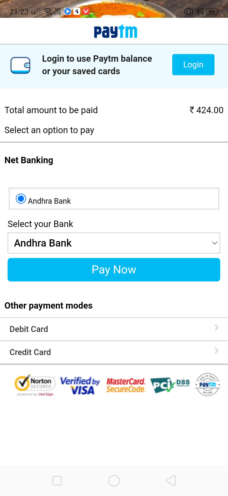
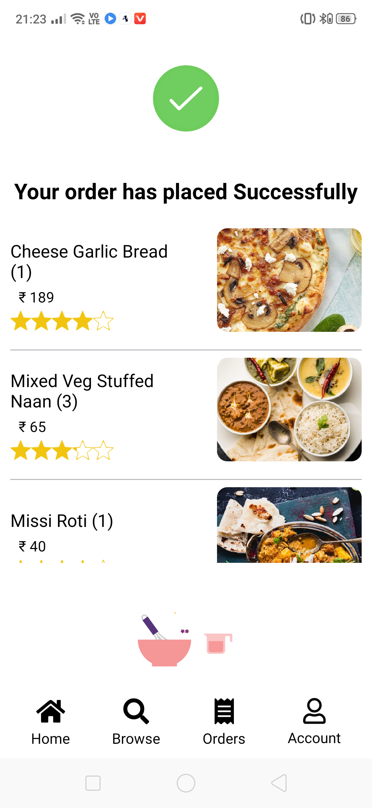

# Food-Delivery-App ( React Native + Django )

  
  
  
 

  
  
  
 

Changes you have to made to backend.
1. In backend edit PaymentViews.py file and write your own Paytm MERCHANT_ID and MERCHANT_KEY 
2. In the same file your have to write your own website url http://example.com/

Changes you  have to made to frontend.
1. Open constant/index.js and write you website url where you have hosted your backend project like "http://example.com/paytm"

# Frontend Only
You can also run only frontend part . Simple clone and run npm install . Howenver backend has been used only for payment purpose..

# Note :-
React native axios request will give error while creating order as localhost is not allowed in react-native-axios you can connect your localhost port to a public url using ngrok easily using command - ngrok.exe http 8000 > hit Enter and then metioned that url in Constants.js . Check this out you will love it , otherwise you need a domain name , or you can host backend on free platform like pythonanywhere.com etc...

# Enjoy 🥳🥳🥳🥳
