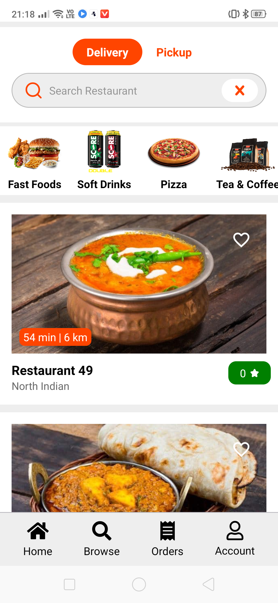

# Food-Delivery-App ( React Native + Django )

  
  
 

Changes you have to made to backend.
1. In backend edit PaymentViews.py file and write your own Paytm MERCHANT_ID and MERCHANT_KEY 
2. In the same file your have to write your own website url http://example.com/

Changes you  have to made to frontend.
1. Open constant/index.js and write you website url where you have hosted your backend project like "http://example.com/paytm"

# Frontend Only
You can also run only frontend part . Simple clone and run npm install . Howenver backend has been used only for payment purpose..

# Note :-
if you are running your backend on localhost payment won't work in this case you can use ngrok. It will replace your localhost server with a realtime public url..
